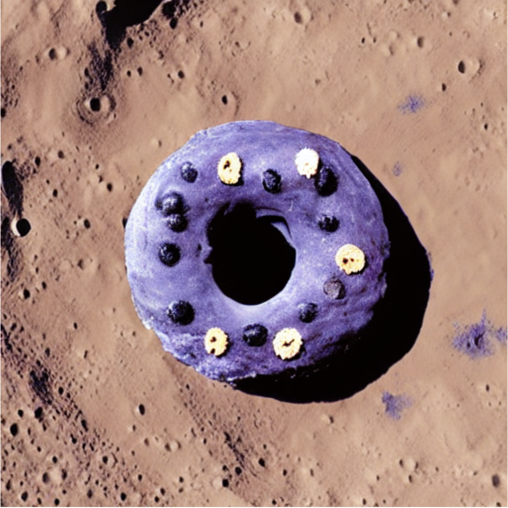

# Stable Diffusion Example 

Implementation of Text-To-Image generation using Stable Diffusion on CPU.
<p align="center">
  
</p>

## Introduction

Stable Diffusion implementation example.

## Install requirements

```bash
pip install -r requirements.txt
```

## Generate image from text description

```bash
usage: demo.py [-h] [--model MODEL] [--seed SEED] [--beta-start BETA_START] [--beta-end BETA_END] [--beta-schedule BETA_SCHEDULE] [--num-inference-steps NUM_INFERENCE_STEPS]
               [--guidance-scale GUIDANCE_SCALE] [--eta ETA] [--tokenizer TOKENIZER] [--prompt PROMPT] [--init-image INIT_IMAGE] [--strength STRENGTH] [--mask MASK] [--output OUTPUT]

optional arguments:
  -h, --help            show this help message and exit
  --model MODEL         model name
  --seed SEED           random seed for generating consistent images per prompt
  --beta-start BETA_START
                        LMSDiscreteScheduler::beta_start
  --beta-end BETA_END   LMSDiscreteScheduler::beta_end
  --beta-schedule BETA_SCHEDULE
                        LMSDiscreteScheduler::beta_schedule
  --num-inference-steps NUM_INFERENCE_STEPS
                        num inference steps
  --guidance-scale GUIDANCE_SCALE
                        guidance scale
  --eta ETA             eta
  --tokenizer TOKENIZER
                        tokenizer
  --prompt PROMPT       prompt
  --init-image INIT_IMAGE
                        path to initial image
  --strength STRENGTH   how strong the initial image should be noised [0.0, 1.0]
  --mask MASK           mask of the region to inpaint on the initial image
  --output OUTPUT       output image name
  ```

## Examples

### Example Text-To-Image
```bash
python demo.py --prompt "blueberry donut on the Moon, 3D realistic"
```

### Example Image-To-Image
```bash
python demo.py --prompt "blueberry donut on the Moon in red color, 3D realistic" --init-image ./data/example.png --strength 0.5
```

### Starter notebook
`starter_notebook.ipynb`: this is a starter notebook example.

## Acknowledgements

* This repository is a fork of: https://github.com/bes-dev/stable_diffusion.openvino
* Original implementation of Stable Diffusion: https://github.com/CompVis/stable-diffusion
* diffusers library: https://github.com/huggingface/diffusers

## Disclaimer

The authors are not responsible for the content generated using this project.
Please, don't use this project to produce illegal, harmful, offensive etc. content.
