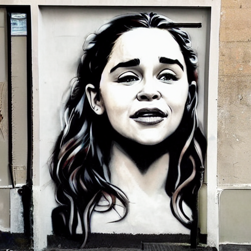
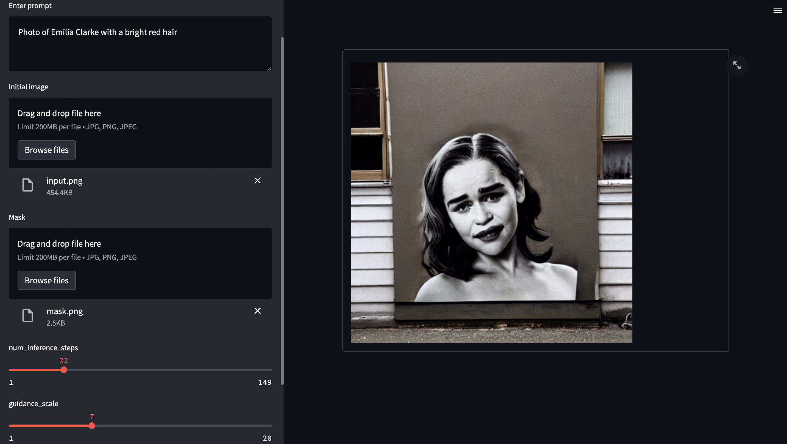

# stable_diffusion.openvino

Implementation of Text-To-Image generation using Stable Diffusion on Intel CPU.
<p align="center">
  
</p>

## Requirements

* Linux, Windows, MacOS
* Python 3.8.+
* CPU compatible with OpenVINO.

## Install requirements

```bash
pip install -r requirements.txt
```

## Generate image from text description

```bash
usage: demo.py [-h] [--model MODEL] [--seed SEED] [--beta-start BETA_START] [--beta-end BETA_END] [--beta-schedule BETA_SCHEDULE] [--num-inference-steps NUM_INFERENCE_STEPS]
               [--guidance-scale GUIDANCE_SCALE] [--eta ETA] [--tokenizer TOKENIZER] [--prompt PROMPT] [--init-image INIT_IMAGE] [--strength STRENGTH] [--mask MASK] [--output OUTPUT]

optional arguments:
  -h, --help            show this help message and exit
  --model MODEL         model name
  --seed SEED           random seed for generating consistent images per prompt
  --beta-start BETA_START
                        LMSDiscreteScheduler::beta_start
  --beta-end BETA_END   LMSDiscreteScheduler::beta_end
  --beta-schedule BETA_SCHEDULE
                        LMSDiscreteScheduler::beta_schedule
  --num-inference-steps NUM_INFERENCE_STEPS
                        num inference steps
  --guidance-scale GUIDANCE_SCALE
                        guidance scale
  --eta ETA             eta
  --tokenizer TOKENIZER
                        tokenizer
  --prompt PROMPT       prompt
  --init-image INIT_IMAGE
                        path to initial image
  --strength STRENGTH   how strong the initial image should be noised [0.0, 1.0]
  --mask MASK           mask of the region to inpaint on the initial image
  --output OUTPUT       output image name
  ```

## Examples

### Example Text-To-Image
```bash
python demo.py --prompt "Street-art painting of Emilia Clarke in style of Banksy, photorealism"
```

### Example Image-To-Image
```bash
python demo.py --prompt "Photo of Emilia Clarke with a bright red hair" --init-image ./data/input.png --strength 0.5
```

### Example Inapinting
```bash
python demo.py --prompt "Photo of Emilia Clarke with a bright red hair" --init-image ./data/input.png --mask ./data/mask.png --strength 0.5
```

### Example web demo
<p align="center">
  
</p>

[Example video on YouTube](https://youtu.be/wkbrRr6PPcY)

```bash
streamlit run demo_web.py
```

or by docker compose

```bash
docker compose -f docker-compose_web.yaml up
```

then, go access to http://localhost:8501

## Performance

| CPU                                                   | Time per iter | Total time |
|-------------------------------------------------------|---------------|------------|
| Intel(R) Core(TM) i5-8279U                            | 7.4 s/it      | 3.59 min   |
| AMD Ryzen Threadripper 1900X                          | 5.34 s/it     | 2.58 min   |
| Intel(R) Xeon(R) Gold 6154 CPU @ 3.00GHz              | 1 s/it        | 33 s       |
| Intel(R) Core(TM) i7-1165G7 @ 2.80GHz                 | 7.4 s/it      | 3.59 min   |
| Intel(R) Core(TM) i7-11800H @ 2.30GHz (16 threads)    | 2.9 s/it      | 1.54 min   |

## Acknowledgements

* Original implementation of Stable Diffusion: https://github.com/CompVis/stable-diffusion
* diffusers library: https://github.com/huggingface/diffusers

## Disclaimer

The authors are not responsible for the content generated using this project.
Please, don't use this project to produce illegal, harmful, offensive etc. content.
